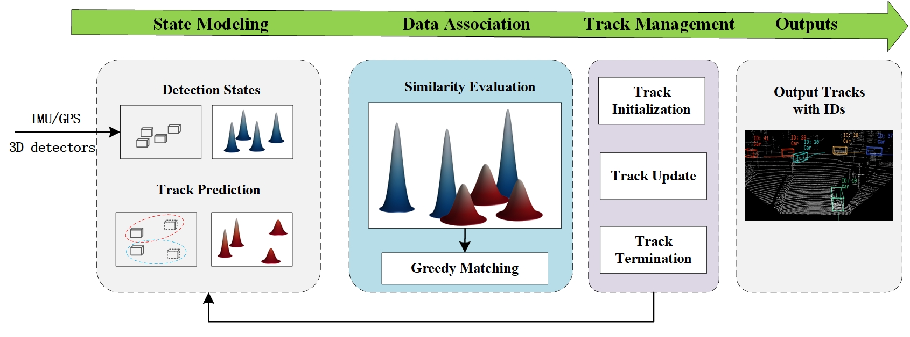

# UG3DMOT

## Abstract
In the existing literature, most 3D multi-object tracking algorithms based on the tracking-by-detection framework employed deterministic tracks and detections for similarity calculation in the data association stage. Namely, the inherent uncertainties existing in tracks and detections are overlooked. In this work, we discard the commonly used deterministic tracks and deterministic detections for data association, instead, we propose to model tracks and detections as random vectors in which uncertainties are taken into account. Then, based on the Jensen-Shannon divergence, the similarity between two multidimensional distributions, i.e. track and detection, is evaluated for data association purposes. Lastly, the level of track uncertainty is incorporated in our cost function design to guide the data association process. We achieve state-of-the-art results across several MOT tasks on the KITTI and NuScenes datasets.


## Benchmark result
We participated in the benchmark challenge of [KITTI](https://www.cvlibs.net/datasets/kitti/eval_tracking.php) and [NuScenes](https://www.nuscenes.org/tracking?externalData=all&mapData=all&modalities=Any), you can check our real-time ranking through the following two links

## Prepare data
### Kitti Dataset
``` 
# For Kitti Dataset    
└── kitti_tracking
       ├── testing 
       |      ├──calib
       |      |    ├──0000.txt
       |      |    ├──....txt
       |      |    └──0028.txt
       |      ├──image_02
       |      |    ├──0000
       |      |    ├──....
       |      |    └──0028
       |      ├──pose
       |      |    ├──0000
       |      |    |    └──pose.txt
       |      |    ├──....
       |      |    └──0028
       |      |         └──pose.txt
       |      ├──label_02
       |      |    ├──0000.txt
       |      |    ├──....txt
       |      |    └──0028.txt
       |      └──velodyne
       |           ├──0000
       |           ├──....
       |           └──0028      
       └── training # the structure is same as testing set
              ├──calib
              ├──image_02
              ├──pose
              ├──label_02
              └──velodyne 
```
```
# Detections
└── casa
       ├── training
       |      ├──0000
       |      |    ├──000001.txt
       |      |    ├──....txt
       |      |    └──000153.txt
       |      ├──...
       |      └──0020
       └──testing 
```
#### Notes
If you are using Casa detector, then you don't need to modify the measurement covariance in [cov_data](./tracking/cov_data.py). If you use other detectors, you need to re-estimate its uncertainty using the method from [here](https://arxiv.org/abs/2001.05673)

### NuScenes Dataset

Download nuScenes perception dataset
```
# For nuScenes Dataset         
└── NUSCENES_DATASET_ROOT
       ├── samples       
       ├── sweeps       
       ├── maps         
       ├── v1.0-trainval 
       ├── v1.0-test
```
To extract timestamp infos/ego infos, run the following:

```
bash preparedata/nuscenes/nu_preparedata.sh <path to nuScenes>/nuscenes
```

Run the following to convert detection results into to .npz files. The detection results should be in official nuScenes submission format(.json)

```
bash preparedata/nuscenes/nu_convert_detection.sh  <path to detection results>/detection_result.json <detector name>

```
#### Notes
We use the Centerpoint detector. If you use other detectors, you need to re-estimate its uncertainty using the method  from [here](https://arxiv.org/abs/2001.05673) and modify the measurement covariance in [cov_data](./tracking/cov_data.py)
## Installation
1. Ubuntu 20.04 and python 3.6
2. Clone the github repository ```git clone https://github.com/wangxiyang2022/DeepFusionMOT```
3. Create and activate a conda environment
4. Installation package ``` pip install -r requirement```
## Quick start
* Please modify the dataset path, detections path and result path in the [Kitti yaml file](./config/kitti.yaml) or [NuScenes yaml file](./config/nuscenes.yaml)
to your own path.
* Then run ``` python3 ./main_kitti.py```  or ``` python3 ./main_nuscenes.py ```
* If you are using the NuScenes dataset, you also need to run ``` bash evaluation/nuscenes/pipeline.sh <trakcer name>``` to merge the results into .json format

## Acknowledgement

The processing code for the  Kitti dataset comes from [here](https://github.com/hailanyi/3D-Multi-Object-Tracker)

The processing code for the  NuScenes dataset comes from  [here](https://github.com/ImmortalTracker/ImmortalTracker)

Many thanks to their wonderful work!

